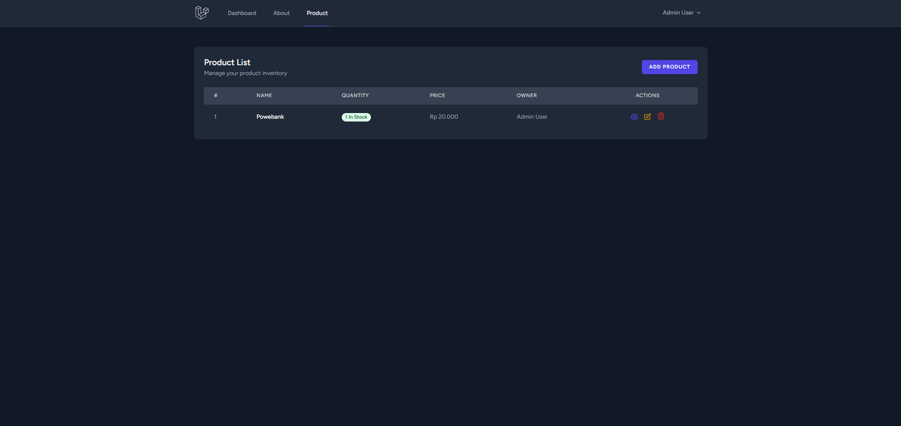
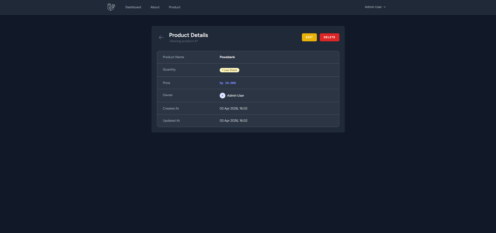
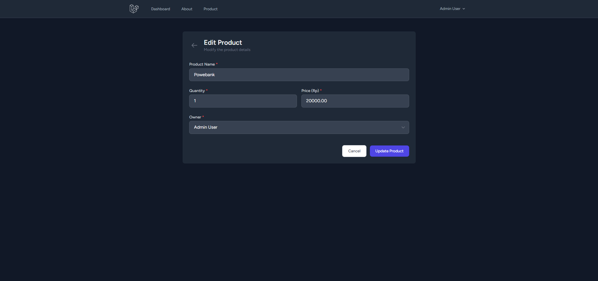
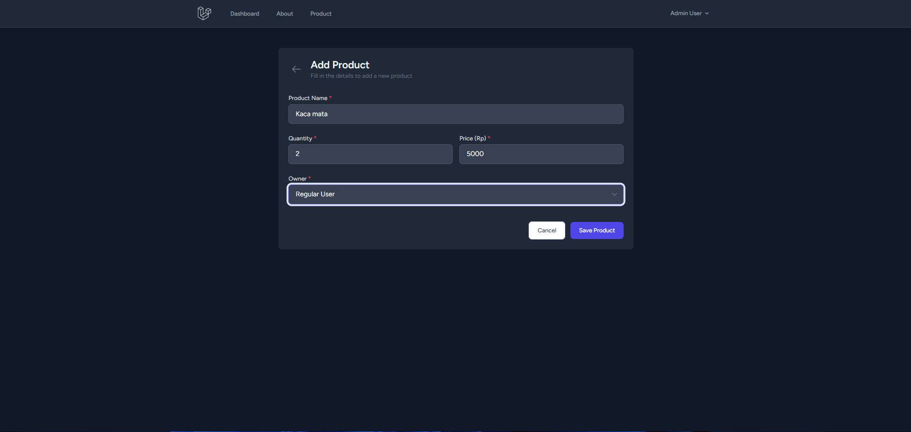

# Laporan Praktikum Pertemuan 5: Otorisasi (Authorization)

Pada pertemuan ini, kita telah mengimplementasikan sistem keamanan tambahan (Authorization) pada aplikasi menggunakan **Role**, **Gate**, dan **Policy**. Berikut adalah rincian pengerjaannya:

## 1. Persiapan Role (Database)
Langkah pertama adalah membedakan jenis pengguna berdasarkan peran (Role) mereka.

*   **Migration**: Menambahkan kolom `role` pada tabel `users` dengan tipe data `string` dan nilai default `user`. Kolom ini diletakkan setelah kolom `password`.
    ```php
    Schema::table('users', function (Blueprint $table) {
        $table->string('role')->default('user')->after('password');
    });
    ```
*   **Model**: Menambahkan atribut `role` ke dalam array `$fillable` pada file `app/Models/User.php`.
*   **Test Data**: Menggunakan `UserSeeder` untuk membuat akun percobaan:
    *   **Admin**: `admin@gmail.com` (password: `password`)
    *   **User Biasa**: `user@gmail.com` (password: `password`)

## 2. Implementasi Gate
Gate digunakan untuk pembatasan akses yang bersifat global atau umum.

*   **Definisi Gate**: Dibuat di dalam `app/Providers/AppServiceProvider.php` dengan nama `manage-product`.
*   **Logika**: Hanya mengizinkan akses jika pengguna memiliki role `admin`.
    ```php
    Gate::define('manage-product', function (User $user) {
        return $user->role === 'admin';
    });
    ```

## 3. Implementasi Policy
Policy digunakan untuk pembatasan akses yang lebih spesifik pada suatu Model data (dalam hal ini Model `Product`).

*   **Pembuatan Policy**: Menjalankan perintah `php artisan make:policy ProductPolicy --model=Product`.
*   **Logika Otorisasi (`update` & `delete`)**:
    *   **User Biasa**: Hanya bisa mengubah/menghapus produk miliknya sendiri (mencocokkan `user_id` pada produk dengan `id` pengguna yang sedang login).
    *   **Admin**: Diberikan akses penuh untuk menghapus atau mengubah produk milik siapa saja.
    ```php
    public function update(User $user, Product $product): bool {
        return $user->role === 'admin' || $user->id === $product->user_id;
    }
    ```

## 4. Penerapan pada Route dan Tampilan (View)
*   **Controller**: Menambahkan `Gate::authorize()` dan `$this->authorize()` pada method-method di `ProductController` untuk mengamankan backend.
*   **Navigation Bar**: Menyembunyikan menu "Product" untuk pengguna biasa menggunakan derektif `@can('manage-product')`.
*   **Product Views**: Menyembunyikan tombol **Edit** dan **Delete** pada halaman Index dan View jika pengguna tidak memiliki hak akses (berdasarkan Policy).

---
*(Dokumentasi screenshot akan ditambahkan di sini)*



